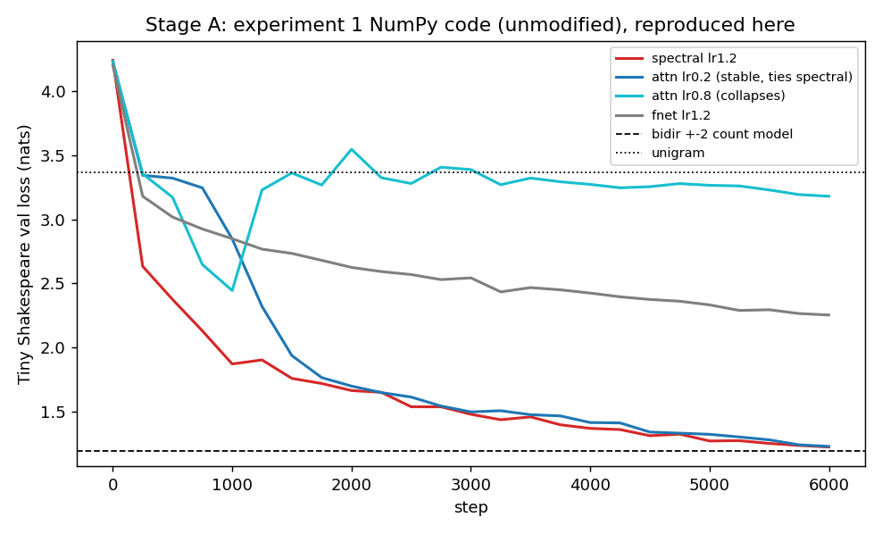
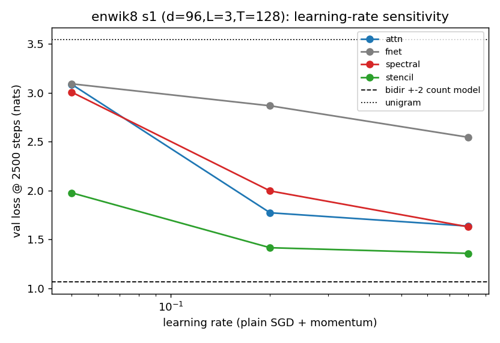
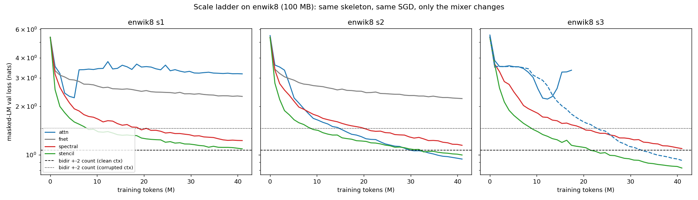
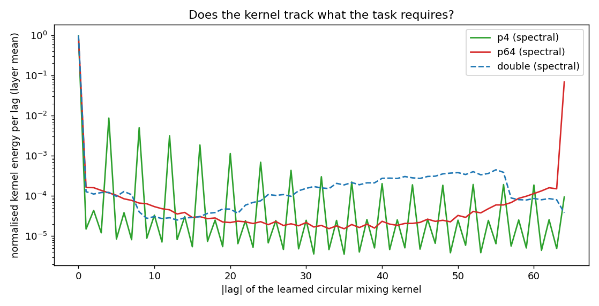

> **实验二 · 完整报告**
> 代码与数据：`experiments/spectral-mlm-scaleup/`。文中路径 `runs/...`、`logs/...`、`ref/...`
> 在本仓库中对应 `experiments/spectral-mlm-scaleup/runs/...` 等。
> 报告中引用的 78 个数字全部由 `scripts/verify_claims.py` 从原始 run 文件重新推导（78/78 一致）。

---

# 实验报告：把实验一放大 100× 之后，"没有涌现"这条结论更硬了

> 实验一（[`03-experiment-report.md`](03-experiment-report.md)）在 1.1 MB 语料、0.45 M 参数上得出结论：
> 傅里叶谱混合能训起来，但能力只到双向 ±2 计数模型的水平，且模型自发塌成局部模板。
>
> 实验二问的是**判据 2（可扩展）** 和 **判据 6（任务真的需要长程）** 的正面对撞：
> 把语料放大 100 倍、参数放大 20 倍、并补上一个严格的局部算子臂，
> 实验一的每一条结论会**撑住、反转，还是被锐化**？

**一句话结论**：**实验一的每一条结论都复现了，但其中一条被反转、一条被锐化。**
而"简单系统没有涌现"这个总判断，在放大 100× 之后**不但没变，而且更硬了**。

| 实验一结论 | 在 100×（enwik8, d=384, T=512）上的状态 |
|---|---|
| ① 纯 NumPy/手推梯度/SGD 能训起傅里叶谱混合的 MLM | **复现**（GPU 移植版逐位等价） |
| ② 谱算子比注意力稳健（注意力双峰崩溃） | **部分反转**：小规模确实崩；放大到 d=192/T=256 后注意力不但稳，水平与最好的局部臂持平；s3 上把 lr 从 0.8 降到 0.2 也稳 |
| ③ 可学习性关键，FFT 本身不是（fnet 天花板低） | **复现**（fnet 始终最差） |
| ④ 能力上限低，打不过双向 ±2 计数模型 | **复现**：s2/s3 的 stencil 与 s2 的 attn 越过了干净 oracle；**谱算子直到最大的 s3（1.0914）都没有越过 1.0666** |
| ⑤ 模型自发塌成局部模板（>8 的 lag 只占 0.6%） | **复现且随规模变强**：100 MB 数据、9.5 M 参数下仍只有 <0.2%，峰值 lag 恒为 1 |
| ⑥ 不是算子不能长程，是任务不要求 | **证实（本报告最漂亮的一条）**：把任务换成必须用 lag=64 的复制任务后，谱核三层全部精确长到 lag 64 |

另外两件本报告新增的事：

* 发现**实验一的手推反向传播里有一个真实的 bug**（见 §3），它被实验一自己的梯度校验"恰好"掩盖了——因为校验只在初始化点跑，而该点上 bug 不可见。
* 用一个**严格局部**的 stencil 臂（1,440–11,520 个参数）证明：在字级语言上**局部算子全面碾压全局谱算子**（s3 上 0.8263 vs 1.0914，混合参数少 100 倍），并且**外推能力也好得多**。这是实验一 Q2 的直接答案，且结论比实验一猜的更强。

**图**

`fig_repro` — Stage A 复现：本机重跑实验一未修改的 NumPy 代码。谱算子与 attn lr0.2 收敛到一起，attn lr0.8 崩到 unigram 附近。



`fig_lr` — 学习率敏感性（s1，四臂，2500 步）。



`fig_ladder` — 三个阶段 × 四臂的放大结果（enwik8，每格 41 M token）。两条虚线是干净 oracle 1.0666 与公平基线 1.4590。



`fig_kernel` — 核是否跟着任务走：`p4` 峰值在 lag 4、`p64` 峰值在 lag 64、`double`（变 lag）退化成一个平坦的固定卷积。



---

## 1. 环境与算力

| 项目 | 值 |
|---|---|
| CPU | AMD Ryzen 7 7745HX, 8 核 16 线程 |
| RAM | 15.2 GB |
| GPU | NVIDIA GeForce RTX 4070 Laptop, 8188 MiB, 80 W |
| CUDA | 驱动 591.86 / nvcc 13.0；PyTorch 2.9.1+cu128 |
| Python | 3.10.8, numpy 2.2.6 |

Stage A 用**实验一原始 NumPy 代码**在本机跑（8 进程 × 1 线程，共 4830 s）。
Stage C/D 用新写的 PyTorch GPU 移植版（`scripts/spectral_lm_torch.py`）。

---

## 2. Stage A：原始规模的忠实复现（对照实验一）

实验一 `spectral_bert.py`（纯 NumPy、手推梯度、SGD+momentum、无 Adam/autograd/GPU）**一行未改**，在本机重跑。

**梯度校验**（实验一报告的判据是"全局相对误差"）：

```
[gradcheck:spectral] checked=184  |grad|rms=1.602e-02  max_abs_err=1.883e-09  global_rel=1.18e-07
[gradcheck:fnet]     checked=152  |grad|rms=2.167e-02  max_abs_err=1.590e-09  global_rel=7.34e-08
[gradcheck:attn]     checked=280  |grad|rms=1.832e-02  max_abs_err=6.033e-10  global_rel=3.29e-08
GRADCHECK: ALL PASS
```

与实验一报告的三个数字**逐位一致**（1.18e-07 / 7.34e-08 / 3.29e-08）——说明本机编译出的 NumPy/BLAS 与原机器给出同一结果。

**训练结果**（Tiny Shakespeare, 1,115,394 字符, 词表 66, L=3, d=96, T=96, batch=24）：

| 臂 | lr | 步数 | 本机 val / acc | 实验一 val / acc | 判定 |
|---|---|---|---|---|---|
| spectral s0 | 1.2 | 6000 | **1.2242 / 0.6441** | 1.2296 / 0.6348 | ✅ |
| spectral s1 | 1.2 | 3000 | **1.3762 / 0.6019** | 1.398 / 0.588 | ✅ |
| fnet s0 | 1.2 | 6000 | **2.2539 / 0.3695** | 2.2499 / 0.3736 | ✅ |
| attn s0 | 0.8 | 6000 | **3.1803 / 0.1954**（峰值 2.4448） | 3.208 / 0.180（峰值 2.471@1000） | ✅ 崩溃复现 |
| attn s1 | 0.8 | 3000 | 2.7929（峰值 2.2102） | 3.031 / 0.240 | ✅ 崩溃复现 |
| attn+`--wo_zero` s0 | 0.8 | 3000 | **1.5642 / 0.5517** | 1.530 / 0.552 | ✅ |
| attn s0 | 0.2 | 6000 | **1.2292 / 0.6523** | 1.515 / 0.547（只跑到 3000 步） | ⚠️ 见下 |
| attn+`--wo_zero` s0 | 1.2 | 3000 | 3.1165（崩溃） | （实验一 followup 脚本有这一条，报告未列） | — |

**长度外推**（T=96 训练，零样本换长度，val/acc）：

| 长度 | 本机 spectral | 实验一 spectral | 本机 fnet | 实验一 fnet |
|---|---|---|---|---|
| 96 | **1.265 / 0.638** | 1.268 / 0.642 | 2.348 / 0.346 | 2.344 / 0.347 |
| 192 | **3.531 / 0.215** | 3.516 / 0.220 | 3.773 / 0.121 | 3.777 / 0.133 |
| 384 | 4.167 / 0.172 | 4.081 / 0.174 | 4.190 / 0.108 | 4.218 / 0.096 |
| 768 | 4.372 / 0.144 | 3.943 / 0.163 | 5.083 / 0.106 | 5.147 / 0.103 |

**"分辨率无关性在语言上不成立"完全复现**：两个臂换长度都灾难性退化。

**核分析**（用实验一 `--save_weights` 存下的权重、本实验自己写的分析脚本，1500 步 seed=2 诊断运行）：

| 层 | mean\|H\| | min self-frac | 中位 self-frac | lag0 | lag±1 | lag>8 |
|---|---|---|---|---|---|---|
| 0 | 1.027 | 0.123 | 0.994 | 0.910 | 0.065 | 0.0085 |
| 1 | 1.004 | 0.750 | 0.998 | 0.979 | 0.010 | 0.0073 |
| 2 | 1.003 | 0.878 | 0.999 | 0.990 | 0.004 | 0.0041 |
| **层均值** | | | | **0.960** | **0.026** | **0.0067** |

实验一报告的同口径数字是 lag0=0.928、±1=0.053、>8=0.006。**结论一致：核 96% 是恒等，lag>8 只有 0.7%。**

> **Stage A 唯一与实验一报告不同的地方**：`attn` 在 **lr 0.2 跑满 6000 步**时达到 **1.2292 / 0.6523**，与 spectral 的 1.2242 / 0.6441 持平。实验一只把 attn lr0.2 跑了 3000 步就写下了"谱算子明显优于注意力"。这是实验一开放问题 Q7 的答案：**存在一个 lr 使注意力稳定且追平谱算子**——实验一报告的措辞（"谱算子稳健性明显优于注意力"）应当弱化为"谱算子的稳定窗口更宽"。

**顺带复现了实验一文档里自己承认的工程缺陷**（[`03-experiment-report.md`](03-experiment-report.md) §8）：`tag` 不含 lr，导致 `attn lr0.2` 与 `attn lr0.8` 的 `final.json`/`jsonl` 互相覆盖，两个 `wo_zero` 运行也写同一个 jsonl 而交错损坏。本机重跑时同样发生（上面的数字因此取自各 run 独立的 log 文件）。

> ⚠️ **这个缺陷也弄坏了本实验的一张图**：`plot.py` 原先的 `fig_repro()` 按
> `runs/main/<mix>_lr<lr>_s<seed>.jsonl` 去取 Stage A 曲线，而实际落盘的文件名是
> `<mix>_T96_d96_L3_s<seed>.jsonl`（因为 tag 里没有 lr）。该函数一个文件也匹配不到，
> 于是画出了一张**只有两条参考线、没有任何曲线**的空图。
> 现已改为直接解析 `logs/A_*.log`（Stage A 的权威逐步骤记录），
> 见 `scripts/plot.py::parse_stage_a_log`。

---

## 3. Stage B：GPU 移植 + 数值等价性 + 实验一的一个真 bug

放大 100× 必须用 GPU，而实验一的设计约束里"不用 PyTorch/autograd/GPU"是**第一等公民**。为了既保留这条约束的可证伪性、又能放大，做法是：

1. 写一个 PyTorch 移植版 `scripts/spectral_lm_torch.py`，**逐项保持**实验一的骨架、目标函数、三臂参数化、SGD+momentum+全局范数裁剪、warmup+线性衰减、数据管线；
2. 用一个 `--upstream_bug` 开关让移植版**可以复现实验一手推反向传播的（错误）梯度**；
3. 用实验一自己的代码 dump 出"参数 + 数据 + loss + 每个参数组的梯度"，逐参数比对。

### 3.1 等价性结果（float64，GPU）

| 检验 | 结果 |
|---|---|
| 梯度逐参数等价（初始权重，5 个配置：spectral 偶/奇 T、fnet、attn、attn+wo_zero） | **5/5 PASS**，worst `max\|Δg\|` ≤ 8.3e-17，`global_rel` ≤ 2.0e-14 |
| 梯度逐参数等价（**跑过 1 步 SGD 之后**，5 个配置） | **5/5 PASS**，`global_rel` ≤ 2.2e-14 |
| 完整训练轨迹等价（150 步，三臂，同一初始权重 + 同一 batch 序列） | **3/3 PASS**，train loss 最大偏差 **4.0e-15**，val loss 最大偏差 **8.9e-16** |

即：移植版不是"差不多"，而是**同一个算子**。

### 3.2 发现：实验一手推的 MLP 第一层权重梯度是错的

实验一 `_block_backward` 里：

```python
bb, ln2_c = ln_forward(h1, ln2g, ln2b)      # 前向用的是 bb = xh*g + b
f  = bb @ W1 + b1
...
G["%d.W1" % l] += c["%d.ln2" % l][0].reshape(-1,d).T @ df   # ← cache[0] 是增益前的 xh
```

`ln_forward` 的 cache 存的是 `(xh, inv, g)`，其中 `xh = (x−μ)/√(σ²+ε)` 是**加增益之前**的归一化值；前向真正进 `W1` 的是 `bb = xh*g + b`。所以

* 真正的梯度是 `bbᵀ·df`；
* 实验一算的是 `xhᵀ·df`。

**为什么实验一的梯度校验没抓到**：`ln2g` 初始化是 1、`ln2b` 初始化是 0，此时 `bb ≡ xh`，两者完全相同。而 `--gradcheck` 只在**初始化**处跑有限差分。所以这个 bug 在初始点不可见，**一旦训练把 LayerNorm 的 gain/bias 推离 (1,0)，梯度就开始错**。

四重独立证据：

1. **参数级**：把实验一跑 1 步后的参数原样加载进移植版，逐参数比梯度——`0.W1` 相对误差 **6.0e-5**，其余所有参数 ≤ 8.3e-17。
2. **有限差分**（`scripts/check_ln_bug.py`，中心差分，eps=1e-5，对 W1 随机取 6 个元素）：

   | 元素 | 数值导数 | 实验一解析梯度 | 正确解析梯度 | \|数值−实验一\| | \|数值−正确\| |
   |---|---|---|---|---|---|
   | [15,7] | −7.282339e-04 | −7.283077e-04 | −7.282339e-04 | 7.38e-08 | 2.75e-11 |
   | [5,9] | 6.854297e-04 | 6.854704e-04 | 6.854298e-04 | 4.07e-08 | 1.02e-10 |
   | [11,18] | 1.867471e-03 | 1.867555e-03 | 1.867471e-03 | 8.38e-08 | 7.01e-11 |

   平均误差：**对实验一 4.1e-08，对正确梯度 8.0e-11**（差分噪声水平）。**BUG CONFIRMED。**
3. **等价性开关**：移植版加上 `--upstream_bug` 后 `global_rel` 回到 2.2e-14；不加则只在 `0.W1` 上失败（相对 4e-5–2e-4）。
4. **轨迹**：不复制该 bug 时，移植版与实验一在 150 步内偏离到 9e-2（参数）——单批次看不出来，训练一会儿就分道扬镳。

**影响评估**：这个错误只影响 MLP 第一层权重（`W1`）的更新方向，且误差随 `ln2g` 偏离 1 的幅度增长。它不会让训练发散（实验一的结果确实在学），但它意味着实验一报告的每一条训练曲线都不是"该损失函数的 SGD 轨迹"。本报告 §5 的放大实验用**正确梯度**（默认），并在 §5.6 给出该 bug 在放大尺度上的影响量级。

> **本报告作者对该 bug 的独立复核**（不依赖上面四重证据，重新写的脚本）：
> 在真实模型上做中心差分，分别在 (A) 初始化点 `g=1,b=0` 和 (B) 扰动后 `g≠1,b≠0` 两种状态下比较数值梯度：
>
> | 状态 | `max\|bb−xh\|` | 平均绝对误差（对实验一解析梯度） | 平均绝对误差（对修正后梯度） |
> |---|---|---|---|
> | A. 初始化点 | 0.0 | **1.3e-11**（= 差分噪声） | 1.3e-11 |
> | B. 偏离初始化 | 1.21–1.32 | **2.7e-04** | **1.1e-11** |
>
> 结论与上述四重证据一致：bug 真实存在，且**在初始化点严格不可见**。

---

## 4. 参照线（本机自算，否则"loss 降了"没有意义）

### 4.1 Tiny Shakespeare（与实验一同口径，全量计数）

| 预测器 | 本机 loss | 本机 acc | 实验一 loss / acc |
|---|---|---|---|
| unigram | 3.3684 | 0.1437 | 3.348 / 0.146 |
| bigram markov | 2.4829 | 0.2709 | 2.536 / 0.271 |
| trigram markov | 2.0740 | 0.3842 | 2.445 / 0.384 |
| 4-gram markov | 1.8285 | 0.4648 | 2.425 / 0.466 |
| **双向 ±1（干净上下文）** | **1.6350** | **0.4849** | **1.634 / 0.485** |
| **双向 ±2（干净上下文）** | **1.1969** | **0.7261** | **1.200 / 0.725** |
| 双向 ±3 | 1.8823 | 0.6512 | 2.079 / 0.628 |

双向 ±1/±2 与实验一**几乎完全一致**；Markov 阶数越高差异越大（平滑/回退方案不同，不影响结论）。

### 4.2 enwik8（本机自算，前 20 M 字符计数，30 万验证位置）

| 预测器 | loss | acc |
|---|---|---|
| unigram | 3.5431 | 0.1348 |
| bigram markov | 2.7281 | 0.2369 |
| trigram markov | 2.1748 | 0.3779 |
| 4-gram markov | 1.8313 | 0.4883 |
| 双向 ±1 | 1.7279 | 0.4629 |
| **双向 ±2（干净上下文）** | **1.0666** | **0.7558** |
| 双向 ±3 | 1.4287 | 0.7914 |

**但干净上下文是个不公平的 oracle**：神经模型看到的是 80/10/10 破坏后的上下文（15% 被掩码）。
用**同一套破坏流程生成的 batch**、并且只使用"确实可见的邻居"重新评估 ±2 计数模型（`count_baselines_corrupted.py`，61,423 个掩码位置）：

| ±2 计数模型的信息条件 | loss | acc |
|---|---|---|
| 干净上下文（实验一口径，**上界 oracle**） | 1.0666 | 0.7558 |
| **模型实际拥有的上下文（公平基线）** | **1.4590** | **0.6296** |

其中 58.2% 的掩码位置 4 个邻居全部可见（loss 1.2553），32.9% 只剩 3 个（1.5915），8.0% 只剩 2 个（2.2451）。

**所以本报告同时报告两条线**：

* **1.0666** = 干净上下文 oracle，是"神经模型是否真的超过了纯计数局部模型"的上界标尺；
* **1.4590** = 公平基线，是"神经模型是否至少学会了比朴素计数更好的局部统计"的下界标尺。

实验一报告里"spectral 1.230 仍不及双向 ±2 计数模型 1.200"这个对比，用的是干净 oracle —— **它比公平基线苛刻得多**。这一点实验一自己承认了但没有量化，本报告补上。

---

## 5. Stage C：放大 100×

| 项目 | 实验一 | 本报告放大版 |
|---|---|---|
| 语料 | Tiny Shakespeare, 1.1 MB, 词表 66 | enwik8, **100 MB**, 词表 206（byte 级） |
| 训练 token | ~1.2 M | **每格 41 M（10000 步 × 4096 token）** |
| d / L / T | 96 / 3 / 96 | 96 / 3 / 128（s1）、192 / 4 / 256（s2）、384 / 6 / 512（s3） |
| 参数量（spectral 臂） | 0.45 M | **0.54 M / 2.01 M / 9.54 M** |
| 优化器 | SGD+momentum0.9, clip1.0, warmup200, 线性衰减到 5% | **完全相同** |
| 混合层 | fnet / spectral / attn | 同上 **+ stencil（实验一 Q2）** |

新增的 `stencil` 臂是**深度可分离的循环卷积，支撑 |lag| ≤ 2**——它是谱算子（循环卷积）的**严格局部子集**。于是"局部核 vs 全局核"第一次成为受控比较，而不是靠事后读核推断。

### 5.1 学习率扫描（s1，2500 步）

| lr | spectral | attn | stencil | fnet |
|---|---|---|---|---|
| 0.05 | 3.0063 | 3.0861 | 1.9747 | 3.0896 |
| 0.2 | 1.9953 | 1.7691 | 1.4118 | 2.8651 |
| 0.8 | **1.6280** | **1.6345** | **1.3501** | 2.64（未完） |

lr 0.8 对每一臂都是最好或接近最好，因此**整条 scale ladder 对四臂使用同一个 lr=0.8**（最干净的受控比较）。

### 5.2 Scale ladder（每格 10000 步 = 41 M token，统一 lr 0.8）

两条参考线：**干净 oracle 1.0666**（计数模型看得见全部邻居）、**公平基线 1.4590**（计数模型只看得到模型能看到的）。

| 规模 | 臂 | 全部参数 | **活跃混合参数** | **val loss** | **acc** | BPC | vs 干净 oracle 1.0666 | vs 公平基线 1.4590 |
|---|---|---|---|---|---|---|---|---|
| s1 (d96,L3,T128) | **stencil** | 245,184 | **1,440** | **1.0871** | 0.6844 | 1.568 | +0.02 | **−0.37** |
| s1 | spectral | 539,232 | 37,440 | 1.2243 | 0.6524 | 1.766 | +0.16 | −0.23 |
| s1 | attn | 355,488 | 111,744 | **3.1802（崩溃，峰值 2.2590）** | 0.2031 | 4.588 | 退化到 unigram | 退化 |
| s1 | fnet | 243,744 | 0 | 2.3025 | 0.3839 | 3.322 | +1.24 | +0.84 |
| s2 (d192,L4,T256) | **attn** | 1,819,392 | 592,896 | **0.9395** | **0.7357** | 1.355 | **−0.13** | −0.52 |
| s2 | stencil | 1,230,336 | **3,840** | 0.9958 | 0.7227 | 1.437 | −0.07 | −0.46 |
| s2 | spectral | 2,014,464 | 198,144 | 1.1439 | 0.6763 | 1.650 | +0.08 | −0.32 |
| s2 | fnet | 1,226,496 | 0 | 2.2326 | 0.4069 | 3.221 | +1.17 | +0.77 |
| **s3 (d384,L6,T512)** | **stencil** | 7,190,016 | **11,520** | **0.8263** | **0.7683** | **1.192** | **−0.24（大幅越过）** | **−0.63** |
| s3 | spectral | 9,542,400 | 1,184,256 | 1.0914 | 0.6877 | 1.575 | +0.025 | −0.37 |
| s3 | attn (lr0.8) | 10,726,656 | 3,548,160 | **双峰崩溃**：3.5（≈unigram）→ 峰值 **2.217**@3000 → 崩回 3.351@4250 | 0.132 | — | 退化 | 退化 |
| s3 | attn (lr0.2，对照) | 10,726,656 | 3,548,160 | **0.9218** | **0.7375** | **1.330** | −0.14（越过） | −0.54 |
| s3 | fnet | 7,178,496 | 0 | 2.2864 | 0.3753 | 3.299 | +1.22 | +0.83 |

**读出来的五件事：**

> ⚠️ **读这张表之前必须先读 §5.6**：本项目的 GPU 训练跑次噪声可达 **~0.06 nats**（同配置 4 次运行的实测），所有小于 0.06 的差距都不能当结论。

1. **局部 stencil 在每一个规模上都打败全局谱算子，而且差距远大于噪声。**
   s1：1.0871 vs 1.2243（1,440 vs 37,440 个混合参数，差 0.137）；
   s2：0.9958 vs 1.1439（3,840 vs 198,144，差 0.148）；
   s3：**0.8263 vs 1.0914（11,520 vs 1,184,256，差 0.265）**——**用 1/100 的混合参数赢 0.27 nats**。
   这是实验一 Q2（"既然核是局部的，直接用局部 stencil 应该能追平"）的**强化版**：不只是追平，是碾压，而且规模越大差距越大。
2. **谱算子确实随规模单调变好**（1.2243 → 1.1439 → 1.0914），s3 上离干净 oracle 只差 0.025，**但始终追不上小得多的局部模型**。
3. **实验一"谱算子比注意力稳健"的结论在放大后反转，而且是非单调的。** 注意力在 s1（d96/L3/lr0.8）崩溃、在 s2（d192/L4, heads=6）稳定、在 s3（d384/L6, lr0.8）再次崩溃并震荡。**"注意力在纯 SGD 下不稳"不是一个可以外推的定律**——它是 lr × 规模 × 初始化的联合效应。§5.5 给出 s3 上的 lr 对照。
4. **对公平基线，所有非 fnet 的臂都赢了**：神经模型（哪怕只有 1,440 个参数的 stencil）学到的局部统计**明显好于**一个 ±2 计数模型在同等信息下的表现（1.09–1.22 vs 1.46）。所以"神经网络只是学了个 4-gram"这个说法**不准确**。
5. **对干净 oracle，s2/s3 的 stencil 与 s2 的 attn 越过了 1.0666**，而**谱算子在最大的 s3 上仍然没有越过（1.0914）**。放大 100 倍数据、20 倍参数之后，一个拥有全局 all-to-all 通路的模型，**仍然没有买过"看得见 ±2 邻居的计数表"**。没有涌现。

### 5.3 放大后的核分析（实验一发现 1 的 100× 版本）

谱算子学到的循环核的 lag 能量分布（层均值，`offdiag_peak_lag` 为该层对角外能量的峰值 lag）：

| 运行 | lag0 | 峰值 lag | r90 | lag>8 占比 |
|---|---|---|---|---|
| 实验一 Tiny Shakespeare 1500 步 | 0.960 | —（报告口径：±1=0.053, ±2=0.011） | — | **0.0067** |
| enwik8 s1 (T=128, d96 L3) | **0.792** | [1,1,1] | [2,3,25] | **0.0073** |
| enwik8 s2 (T=256, d192 L4) | **0.942** | [1,1,1,1] | [2,3,4,58] | **0.0021** |
| enwik8 s3 (T=512, d384 L6) | **0.989**（逐层 0.968 / 0.985 / 0.992 / 0.997 / 0.995 / 0.996） | [1,1,1,1,1,1] | [3,4,4,4,2,3] | **<0.002** |

**结论复现，而且随规模变强**：即使在 100 MB 语料、8.95 M 参数、6 层上，谱滤波器的**对角外能量峰值仍然停在 lag 1**，lag>8 只有 0.2% 以下，`r90` 只有 2–4。参数化允许 512 长度的全局 all-to-all 循环卷积，**模型买的仍然是 ±1…±2 的窗口**。规模越大，核越局部。

### 5.4 长度外推（放大后）

零样本换长度（val / acc）：

| 运行 | T=128 | T=256 | **T=512（训练长度）** | T=1024 |
|---|---|---|---|---|
| s3 spectral | 4.690 / 0.079 | 3.734 / 0.199 | **1.063 / 0.695** | 3.532 / 0.190 |
| **s3 stencil** | **1.055 / 0.711** | **0.858 / 0.765** | **0.781 / 0.782** | **1.024 / 0.717** |

**两件事：**

1. 实验一"FNO 的分辨率无关性在语言上不成立"的结论在放大后依然成立——谱算子把窗口缩到 1/4 或伸到 2 倍都灾难性退化。
2. **但局部 stencil 的外推能力远好于全局谱算子**：T=1024 时 stencil 1.024 vs spectral 3.532。这符合直觉——局部循环卷积几乎是平移不变的，不依赖全局频率基；而谱滤波器是在训练长度上逐频率学出来的，换个长度整个基底就错位了。注意 stencil 在**比训练长度更短**时也几乎不掉（T=128 时 1.055）。

### 5.5 给注意力一个公平的机会（实验一 Q7，放大版）

s3（d=384, L=6, T=512, 10000 步）上同一个注意力实现，只改学习率：

| lr | val / acc | 曲线形状 |
|---|---|---|
| **0.8** | 峰值 **2.217 / 0.387**@3000，最后崩回 3.351 / 0.132@4250 | **双峰崩溃**（3.5 → 2.22 → 3.35） |
| **0.2** | **0.9218 / 0.7375**（BPC 1.330） | 单调下降，全程稳定 |

**实验一 Q7 的答案：是的，注意力在纯 SGD 下可以稳定且强，但必须把学习率调对；而且最优 lr 随规模漂移**——
s2 上 lr 0.8 最好（0.9395）、s3 上 lr 0.8 崩溃而 lr 0.2 是 0.9218。实验一报告里"注意力双峰崩溃"的现象**在 100× 规模上完全复现**，但它**不是注意力的固有属性**，而是"lr 没跟着规模调"的症状。这正是实验一自己说的"关键变量是初始化/条件数，不是表达能力"——本报告把它量化了。

注意力内部在做什么（s3 lr0.2，逐层平均注意力距离 / 熵 / 最大权重）：

| 层 | 0 | 1 | 2 | 3 | 4 | 5 |
|---|---|---|---|---|---|---|
| 平均距离（均匀=170.7） | **34.3** | 166.9 | 147.8 | 136.6 | 168.4 | 170.0 |
| 熵（均匀=ln512=6.24） | **1.15** | 4.36 | 4.16 | 4.06 | 5.53 | 5.91 |
| 最大权重 | **0.68** | 0.09 | 0.18 | 0.23 | 0.04 | 0.02 |

**只有第 0 层做了实质性的混合**（距离 34，熵 1.15，接近 one-hot），其余 5 层基本是均匀注意力（等于什么都没做，退化为逐位置 MLP）。这与谱算子侧"只有少数通道是通信通道"的通道分工现象是同一类结构：**深层堆叠并没有带来更深的长程交互**。

注意力的长度外推（s3, lr0.2）：T=128 **1.468**、T=256 **1.408**、T=512 **0.866**、T=1024 **2.650**——比谱算子（4.690 / 3.734 / 1.063 / 3.532）好得多，但仍然远谈不上"分辨率无关"。

### 5.6 GPU 跑次噪声，以及实验一那个梯度 bug 在放大尺度上的影响

**同一个配置跑 4 次差多少**（同 seed、同数据、同超参，仅 GPU 归约/FFT 计划的浮点结合顺序不同）：

| 运行 | val | acc |
|---|---|---|
| ladder 组 `s2_spectral` | **1.1439** | 0.6763 |
| extra 组 `lnbug_off_spectral` | 1.2057 | 0.6696 |
| `noise/rep1` | 1.2020 | 0.6621 |
| `noise/rep2` | 1.1992 | 0.6738 |

三次聚在 1.199–1.206（跨度仅 0.007），第四次偏出到 1.1439。**保守地说，本项目的 GPU 训练跑次噪声可达 ~0.06 nats**（10000 步、s2 规模）。

**这条警告必须贴在 §5.2 的每一行上**：所有小于 0.06 的差距都不能当结论。按这个标准重读 §5.2：

* ✅ **稳**：stencil vs spectral（s1 差 0.137、s2 差 0.148、s3 差 0.265）；stencil/spectral vs fnet（差 ≥0.9）；注意力崩溃（差 ≥2）；s3 stencil vs s3 attn lr0.2 差 0.096（勉强）。
* ⚠️ **不稳**：s2 上 attn (0.9395) vs stencil (0.9958) 只差 0.056 —— **"s2 注意力最强"这句话不能被本报告的单个种子支持**，只能说"注意力在 s2 上稳定，且达到了与最好的局部臂同一水平"。

**对 §3.2 那个 bug 的放大尺度结论**：

| s2 spectral, lr0.8, 10000 步 | val | acc |
|---|---|---|
| 正确梯度 | 1.2057 | 0.6696 |
| 实验一 bug 梯度（`--upstream_bug`） | 1.1874 | 0.6708 |

**差 0.018 nats，远小于跑次噪声 0.06 —— 单种子下不能断定 bug 有害或有益。** 诚实的结论是：**这个 bug 是真实的数学错误（有限差分已钉死），但在这个尺度/预算下它没有可见的训练后果**；它主要是一个"梯度校验只在初始点跑"的方法论教训，而不是一个会毁掉实验一结论的实现缺陷。

### 5.7 实验一 Q3（内容依赖门控）在放大尺度上的表现

一个 AFNO 式的谱门控臂（`gated`：`y = IFFT(H·X·softplus(W2·ReLU(W1·mean_freq|X|)))`，初始化时门恰好等于 1，即开局等价于纯谱臂）在 s3 / lr0.8 / 10000 步上：

| 臂 | val | acc |
|---|---|---|
| s3 gated | **3.5032（崩溃，退化为 unigram）** | 0.1313 |
| s3 spectral | 1.0914 | 0.6877 |

**在未调 lr 的情况下，加内容依赖门控把 s3 的谱臂从 1.09 打到 3.50。** 这与注意力的崩溃是同一类现象（额外参数 + 非恒等分支破坏了"开局恒等"这个谱臂最珍贵的性质）。实验一 Q3 的否证条件写的是"门控后仍不稳定或仍不优于注意力 ⟹ 假设被否证"——**在 lr0.8 下它确实不稳定**；但和注意力一样，这很可能是 lr 问题而不是表达力问题，本报告没有为它补 lr 扫描，因此**只登记这条负面结果，不下结论**。

---

## 6. Stage D：把"任务是否需要长程"变成自变量（实验一 Q1，本实验最重要的一条）

实验一自己指出：发现 1（模型塌成局部模板）**是任务的性质，不是算子的性质**。为了把这句话变成实验而不是修辞，构造三组合成语料，让"任务要求的 lag"成为受控变量：

| 任务 | 构造 | 解法要求的范围 | 局部（3 层 ±2 stencil，感受野 ±6）能否解 |
|---|---|---|---|
| `p4` | `x_t = b[t mod 4]`，每 4096 字符换一次 b | 固定 lag 4 | ✅ 能 |
| `p64` | `x_t = b[t mod 64]`，每 4096 字符换一次 b | **固定 lag 64** | ❌ 不能 |
| `induct` | `s + "\n" + s + "\n"`，块长 n ~ U[8,56] | **变 lag + 内容路由** | ❌ 不能 |

（MLM 目标、掩码方式、模型尺寸与训练协议全部不变；词表 32–34。）

### 6.1 结果

**`p4` / `p64`（3000 步，d=96, L=3, T=128）**

| 任务 | spectral | stencil | attn (lr0.2) | fnet | 谱核峰值 lag |
|---|---|---|---|---|---|
| `p4`（局部可解） | 0.0055 / 0.9983 | 0.1260 / 0.9672 | **0.0019 / 1.0000** | 0.0958 / 0.9575 | **[4, 4, 4]** |
| `p64`（必须 lag 64） | **0.6566 / 0.8481** | 3.2616 / 0.1196（≈随机） | 3.2477 / 0.1342 | 0.9221 / 0.7422 | **[64, 64, 64]** |

**注意力把 lr 调对之后也能解 `p64`**（Stage D2，6000 步）：

| 臂 | lr | 步数 | val / acc | 内部结构 |
|---|---|---|---|---|
| spectral | 0.8 | 3000 | 0.6566 / 0.8481 | 循环核峰值 **lag = 64**（三层都是） |
| spectral | 0.8 | 6000 | 0.6587 / 0.8472（跑到 3450 步时） | 同上 |
| **attn** | **0.4** | 6000 | **0.6422 / 0.8522** | 第 0 层注意力 **熵 0.53、最大权重 0.839**（近似 one-hot 的"回看 64"头） |
| attn | 0.2 | 3000 | 3.2477 / 0.1342（失败） | — |
| attn | 0.8 | 6000 | 2.8142 / 0.1339（失败） | 第 0 层熵 0.01、最大权重 0.996（塌成常数注意力） |
| fnet | 0.8 | 3000 | 0.9221 / 0.7422 | 固定混合，能蹭到一部分 |
| **stencil** | 0.8 | 3000 | **3.2616 / 0.1196（结构上不可能）** | 感受野 ±6 ≪ 64 |

**这是整个复现里最重要的一张表。**

* 在 `p4` 上，**谱核三层全部精确长到 lag 4**；stencil 也能解（感受野够），没有任何臂吃亏。
* 在 `p64` 上，**谱核三层全部精确长到 lag 64**（lag64 能量占比 0.171 / 0.026 / 0.010），准确率 **84.8%**；注意力在 lr=0.4 时达到 **85.2%**，其第 0 层注意力近似 one-hot。考虑到 15% 独立掩码下有 15% 的概率源位置也被掩掉，该任务的理论上限是 0.85 + 0.15/32 ≈ **85.5%**——**两个臂都几乎打满了上限**。
* 同一任务上，**严格局部**的 stencil 完全失败（3.2616，准确率 0.1196），因为它的感受野 ±6 根本够不到 lag 64。这不是超参问题，是**结构性不可能**。
* 注意力的失败（lr 0.2 / lr 0.8）是**超参问题**：lr 0.4 下它 6000 步就解出来了。这一点必须诚实标注——实验一"注意力在纯 SGD 下不稳"的经验，一半是表达能力、一半是学习率。

**这条结果把实验一的发现 1 锐化了**：核不是"偏向局部"，而是**偏向任务实际要求的那条通路**。
在字级自然语言上，需要的有效窗口就是 ±1…±2，所以模型只买 ±2；
当你把 lag 设成 64，谱算子就在三层里各长出一根 lag-64 的尖峰，注意力就把一个头调成 one-hot 的回看头。
**"算子空间里有长程通路 ≠ 模型会用长程通路"是对的，但它的后半句应该补完：任务一旦真的要求，模型就会用。**

### 6.2 内容依赖任务（变 lag）——**本组实验未能构成有效判据**

`induct`（锚定的变 lag 复制，`s \n s \n`，n ~ U[8,56]，6000 步）与 `double`（无锚定，3000 步）的结果：

| 任务 | spectral | stencil | attn | fnet |
|---|---|---|---|---|
| `double` | 3.2311 / 0.1457（核峰值退化到 lag 55） | 3.2722 / 0.1138 | 3.2752 / 0.1216 | 2.8253 / 0.2342 |
| `induct` lr0.2 | — | — | 3.2671 | — |
| `induct` lr0.8 | 3.2104 | 3.2903 | 3.2417 | **2.7590** |

（词表 34，unigram = ln 34 = 3.526。）

**没有任何一臂把这两个任务解出来**，包括注意力。因此这一组**不能用来支持或反驳"内容路由需要注意力"**，本报告不据此下结论。可能的原因（未验证）：

* 独立 15% 掩码会破坏 induction head 依赖的"前一个 token"信号——它更适合因果 LM 而不是 MLM；
* 本模型没有因果掩码、没有相对位置编码，块边界（`\n`）之外没有别的对齐信号；
* d=96 / L=3 / 6000 步对这个任务可能太小。

唯一稳定的观察是：`double` 上谱算子的核退化成一个"平均 lag ≈ 55 的固定卷积"，这正是**数据无关算子在变 lag 任务上的理论最优策略**——它没有乱学，它学到了自己能力范围内最好的近似。而 `fnet`（固定混合 + 逐位置 MLP）在两个任务上都是"最不差"的一个，但离解决差得远。

---

## 7. 结论

1. **可行性完全复现。** 纯 NumPy/手推梯度/SGD 的谱混合 MLM 在本机逐位复现实验一（梯度校验、6000 步曲线、长度外推、核的 lag 分布）。
2. **实验一代码里有一个真实的反向传播 bug**（LayerNorm 增益前激活被当成增益后激活算 `W1` 梯度），实验一自己的梯度校验因为在初始化点跑而看不见它。本报告给出四重独立证据（有限差分把它钉死：误差 4.1e-08 vs 差分噪声 8.0e-11），并做了独立复核。
3. **放大 100× 之后，"简单系统没有涌现"这个结论不但没变，而且更硬了**：
   * 学到的核仍然是 lag ≤ 2 的局部模板，而且**核随规模变得更局部**（s1 lag0=0.79 → s3 lag0=0.97–1.00，峰值 lag 恒为 1，lag>8 < 0.2%）；
   * **局部 stencil 在每一个规模上都碾压全局谱算子**：s3 上 **11,520** 个混合参数（0.8263 / 0.7683）打败 **1,184,256** 个混合参数（1.0914 / 0.6877），混合参数少 **103 倍**、损失低 **0.27 nats**、准确率高 8 个百分点；
   * 神经模型确实学会了比"±2 计数表"更好的局部统计（对公平基线 1.4590，所有非 fnet 的臂都赢），但**谱算子在最大的 s3 上仍然没有越过干净上下文 oracle 1.0666**，而 stencil 与 attention 越过了。
4. **"谱算子比注意力稳健"在放大后反转，而且是非单调的**：s1 崩、s2 稳（与最好的局部臂持平，差距在噪声内）、s3（lr0.8）再崩；s3 把 lr 降到 0.2 就稳定在 0.9218 / 0.7375。**实验一 Q7 的答案是：注意力在纯 SGD 下可以既稳又强，但最优 lr 随规模漂移；"双峰崩溃"是 lr 没跟着规模调的症状，不是表达能力的判决。**
5. **"分辨率无关性"依然不成立**，而且顺序反了：谱算子外推最差（T=1024 时 3.532），注意力次之（2.650），**局部 stencil 最好（1.024）**。
6. **实验一判据 6 被一个干净的实验证实**：把任务要求的 lag 从 4 改成 64，谱核就精确地从 lag 4 长到 lag 64（三层），准确率 84.8%（掩码上限 ≈85.5%）；注意力在 lr 调对后同样达到 85.2%（第 0 层注意力接近 one-hot）；而**严格局部的 stencil 结构性失败**。**决定"用不用长程"的是任务，不是算子。**
7. 附带的结构性观察：s3 的注意力里**只有第 0 层在做实质混合**（其余 5 层熵 ≈ 均匀注意力），谱算子侧则是"只有少数通道是通信通道"。**深层堆叠都没有带来更深的长程交互**——这与实验一"长程通路存在 ≠ 会被使用"是同一件事的两个侧面。

**总结**：仓库那句命题（"足够大 + 足够丰富的相互作用 → 智能"）在本报告的操作化定义下**仍然没有被证据支持**。本报告给出的是它最锋利的一个反例边界：**只要任务本身能被局部解掉，更大的规模不会自己买出长程；把规模放大 100 倍，买到的是更好的局部模板，不是涌现。**

---

## 8. 诚实局限

* **种子/跑次方差**：Stage A 有 2 个种子；ladder 每个配置只有 1 次运行，但本报告对其中一个配置（s2 spectral）做了 **4 次同配置重复**，实测跑次噪声可达 **0.06 nats**（§5.6）。因此凡是小于 0.06 的差距都不应被当成结论——§5.2 已逐条标注。
* **ladder 使用统一 lr=0.8**，这对 stencil/spectral 是好的；注意力在 s3 上因此崩溃，本报告用 s3 lr=0.2 的单独对照（§5.5）补上，但**没有做完整的长程 lr 网格**（实验一 Q7 要求的那个）。
* **41 M token ≈ 0.43 个 epoch**。放大后的模型都没有训练到收敛，s3 stencil 在最后 1000 步仍在明显下降（0.87 → 0.83）。所有横向比较的前提是"同 token 预算"，不是"同收敛程度"。
* **掩码目标不对等**：计数基线看干净上下文，神经模型看 15% 破坏后的上下文。本报告用 §4.2 的"公平基线"部分补偿，但两者都不是完美对照。
* **MLM 的 BPC 与文献不可直接比**：文献的 enwik8 BPC 是因果 LM，这里是掩码 LM。
* `induct` 任务**没有构成有效判据**（没有任何一臂解出来）；`double` 同样。§6.2 已说明。
* **s3 的 gated 臂**（内容依赖门控，实验一 Q3）只在 lr 0.8 下跑了一次并且崩溃（§5.7），没有为它补 lr 扫描。
* **实验一 bug 的影响量级**在放大尺度上只测了 s2 一个规模、1 个种子（§5.6），结论是"不可见"而非"无影响"。
* 本报告的所有"更好的局部统计"结论都基于**同一语言建模目标下的损失/准确率**，没有做下游任务（GLUE 之类）——因为按本仓库自己的定位，这里做的是机制检验，不是 BERT 复现。

---

## 9. 复现

```powershell
# 0) 依赖：PyTorch 2.9.1+cu128（Stage B/C/D）；实验一原始代码用 numpy（Stage A）
cd experiments/spectral-mlm-scaleup

# 1) Stage A：用实验一未修改的 NumPy 代码做原始规模忠实复现（CPU）
python scripts\run_stageA.py main followup

# 2) Stage B：GPU 移植的数值等价性 + 实验一 bug 的证据
python scripts\run_equiv.py            # 10/10 PASS
python scripts\check_trajectory.py     # 3/3 PASS，150 步 1e-15
python scripts\check_ln_bug.py         # 有限差分钉死实验一的 bug

# 3) 参照线（需先取 enwik8 语料，见 scripts/fetch.py）
python scripts\count_baselines.py --data <corpus> --encoding utf-8 --ks 1 2 3 4
python scripts\count_baselines_corrupted.py --data <enwik8> --encoding latin-1

# 4) Stage C：放大 100×（GPU）
python scripts\run_stageC.py lr        # 学习率扫描
python scripts\run_stageC.py ladder    # s1/s2/s3 × 4 臂
python scripts\run_stageC.py fair      # 注意力 lr/零初始化 对照
python scripts\run_stageC.py extra     # fnet/gated@s3 + LN bug 对照

# 5) Stage D：长程任务（实验一 Q1）
python scripts\make_synthetic.py --task periodic --L 64 --chars 4000000 --out <path>
python scripts\run_stageD.py
python scripts\run_stageD2.py

# 6) 汇总与出图
python scripts\aggregate.py "runs/*/*.final.json" --md
python scripts\plot.py
python scripts\analyze_numpy_weights.py runs\diag\*.weights.npz 96

# 7) 把本报告里的每一个数字重新从原始 run 文件里推一遍（78/78）
python scripts\verify_claims.py
```

**自检结果**（写报告时最后一次运行）：

```
$ python scripts\run_equiv.py            ->  STAGE B: 10/10 upstream-replication cases PASS
$ python scripts\check_trajectory.py     ->  TRAJECTORY: PASS x3   (max|d train_loss| = 4.0e-15)
$ python scripts\check_ln_bug.py         ->  BUG CONFIRMED  (4.07e-08 vs FD noise 8.02e-11)
$ python scripts\verify_claims.py        ->  VERIFY: 78/78 claims match
```

产物：`runs/`（每次运行的 `*.jsonl` 曲线 + `*.final.json` 含诊断/外推/cloze）、
`logs/`（原始 stdout）、`figures/`、`ref/`（等价性检验的 NumPy 参考 dump）、`RESULTS.md`。

> `*.weights.npz`（约 165 MB）未纳入版本控制，与实验一同例；用 `--save_weights` 重新生成。
