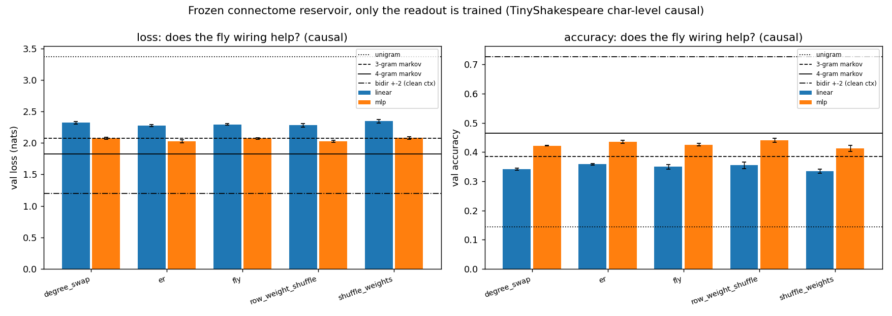
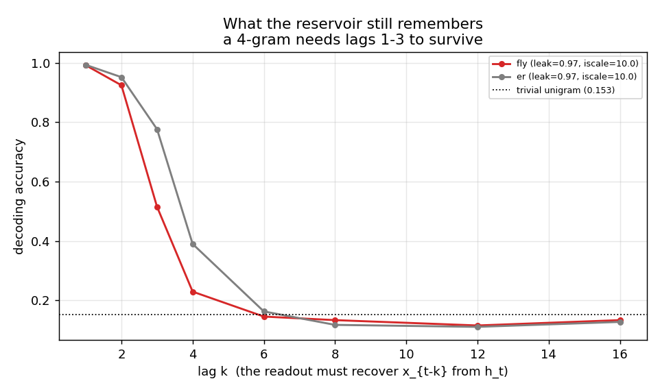
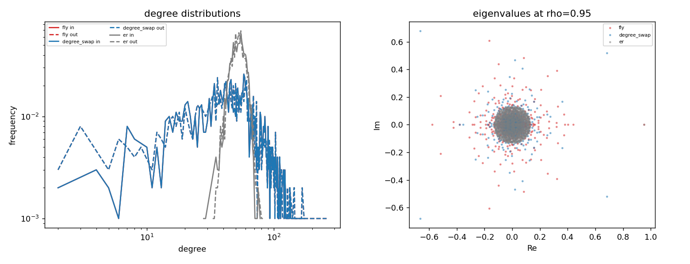

> **实验三 · 完整报告**
> 代码与数据：`experiments/fly-connectome-reservoir/`。
> 报告中引用的 63 个数字全部由 `scripts/verify_claims.py` 从原始结果文件重新推导（63/63 一致）。

---

# 实验报告：把果蝇全脑连接组当储层，它能学会 4-gram 吗？

> 实验一/二把"简单系统能否涌现"拆成了六条判据，并用傅里叶谱混合、注意力、stencil
> 三种**人工设计**的混合算子反复检验。实验三换一个完全不同的来源问同一个问题：
> **把一只果蝇的真实接线当作算子，会怎样？**
>
> 这是这个仓库里第一次用**生物结构**而不是人造参数化来做混合。

**一句话结论**：**不能，而且果蝇的接线不比随机接线更好。**
一个冻结的 FlyWire 连接组储层 + 训练好的读出层，最好也只达到 **3-gram** 的水平
（2.0271 vs 4-gram 的 1.8285），而且在同一套读出下**结构完全随机的 Erdős–Rényi 图
反而更好**（2.0279 vs 果蝇的 2.0720）。机制是清楚的：**果蝇的 hub 核心忘得更快**——
状态里 lag-3 的可解码信息只剩 0.515，而配对随机图有 0.777，而 4-gram 恰恰需要 lag 1–3。

这个结果与已有的独立先例一致：[`flybook-git/flm`](https://github.com/flybook-git/flm)
把 MaleCNS 连接组接到一个 1.2B 语言模型上，其 README 自己写明
*"Its matched direct-input control performed slightly better; it does not establish an
advantage from fly anatomy."*

**图**

`fig_reservoir` — 五条接线 × 两种读出，对照实验一/二的计数参照线。



`fig_memory` — 状态里还剩多少 k 步之前的信息。这是解释上面那张图的机制。



`fig_wiring` — 对照图到底保持了什么：度分布与特征值谱。



---

## 1. 先纠正两个前提

### 1.1 连接组不是"权重"，没有预训练好的果蝇可以加载

FlyWire v783 提供的是**结构连接**：16,847,997 行 `(pre, post, neuropil)` 三元组，
54,492,922 个突触，外加 6 个神经递质预测概率。**没有**任何"训练好的果蝇模型"。
能从它得到的只有一张**带符号的稀疏邻接矩阵**。

本实验的做法是把连接组当作**固定的循环动力系统**（储层/reservoir）：

```
h_t = tanh( W @ (leak * h_{t-1} + (1 - leak) * u_t) ),   u_t = U[:, tok_t]
logits_t = h_t @ Wout + b
```

`W`（连接组）与 `U`（固定随机输入投影）**全程冻结**，只有 `Wout, b` 被训练。
这样任何两条接线之间的差异都只能归因于接线，不能归因于优化器。

### 1.2 连接组没有位置结构，而 4-gram 是平移不变的

这是真正的障碍，也是"直接接进去"为什么不行：实验一/二的所有混合算子都是
**位置→位置**的映射且平移等变；连接组是**神经元→神经元**的图，既没有"第 t 个位置"，
也不满足平移等变。把邻接矩阵直接当成 T×T 位置混合矩阵，会让模型只能逐位置死记，
**原理上就学不出平移不变的 4-gram 统计**——那样的失败是设计错误，不是科学结论。

储层框架绕开了这个问题：接线只负责提供动力学，token 通过固定随机投影驱动它。
代价是**放弃了"接线直接决定位置间信息流"这一层解释**，这是本实验必须承认的口径损失。

---

## 2. 五条接线（全部归一到同一谱半径）

| 名字 | 保留什么 | 破坏什么 |
|---|---|---|
| `fly` | 真实连接组（top-1000 强连接核心） | — |
| `degree_swap` | 无权重入/出度序列、权重多重集 | 具体拓扑（双重边交换，533,620 次全接受） |
| `row_weight_shuffle` | 拓扑**完全不变**、每个神经元入权重总和**精确不变** | "哪条输入有多强"的分配 |
| `shuffle_weights` | 拓扑**完全不变** | 权重的全局分配（行和不再保持） |
| `er` | 只有节点数（1000）与边数（53,362） | 其他一切 |

全部按 `rho(W) = 0.95` 重新缩放，使**动力学可比、只有接线不同**。
不变式由 `scripts/verify_graphs.py` 逐条机器校验（**23/23 通过**）；
连接组的读取方向与符号逻辑由 `scripts/test_load_flywire.py` 用合成表校验
（**10/10 通过**，覆盖 `W[post,pre]` 朝向与 GABA/谷氨酸→抑制 的判定）。

### 2.1 果蝇子图长什么样

| 项目 | 值 |
|---|---|
| 神经元数（top-1000 按突触总量） | 1,000 |
| 保留边数 | 53,362（密度 5.34%） |
| 原表行数 / 总突触数 | 16,847,997 / 54,492,922 |
| 核心内突触数 | 959,092 |
| 每条边平均 / 最大突触数 | 17.97 / 2,405 |
| 抑制性连接占比 | **54.36%** |
| 权重强度（log1p） | −7.786 … +7.168 |

**任务与参照线**：TinyShakespeare 字级下一 token 预测，与实验一逐位同一切分
（train 1,059,625 / val 55,769 / V=66）。参照线直接复用实验二的
`count_baselines.py`，因此和实验一/二的表可比：

| 参照 | loss | acc |
|---|---|---|
| unigram | 3.3684 | 0.1437 |
| 2-gram markov | 2.4829 | 0.2709 |
| **3-gram markov** | **2.0740** | 0.3842 |
| **4-gram markov** | **1.8285** | **0.4648** |
| bidir ±2（干净上下文） | 1.1969 | 0.7261 |

---

## 3. 结果：果蝇接线没有优势

3 个种子（配对：所有接线共用同一批训练位置与同一输入投影种子）、N=1000、
leak=0.97、input_scale=10（**超参在合成 ER 图上选定，从未在果蝇图上调过**）：

| 接线 | linear 读出 val loss | linear acc | **MLP 读出 val loss** | MLP acc |
|---|---|---|---|---|
| **`er`**（纯随机） | **2.2774 ± 0.0157** | **0.3581** | **2.0279 ± 0.0263** | 0.4358 |
| **`row_weight_shuffle`** | 2.2809 ± 0.0251 | 0.3546 | **2.0271 ± 0.0144** | **0.4406** |
| `fly`（果蝇） | 2.2965 ± 0.0115 | 0.3496 | 2.0720 ± 0.0122 | 0.4254 |
| `degree_swap` | 2.3214 ± 0.0173 | 0.3412 | 2.0748 ± 0.0132 | 0.4217 |
| `shuffle_weights` | 2.3455 ± 0.0264 | 0.3347 | 2.0795 ± 0.0173 | 0.4126 |

**读出来的四件事：**

1. **没有任何一条接线学会 4-gram。** 最好的 MLP 结果 2.0271 离 4-gram 的 1.8285 还差
   **0.20 nats**；它落在 **3-gram（2.0740）**的水平上——损失略好，准确率明显更好
   （0.4406 vs 0.3842）。所以准确的表述是：
   **一个冻结连接组储层 + 训练读出层，学到的是大约 3-gram 的统计，不是 4-gram。**
2. **果蝇接线不是最好的，两种读出下都不是。** 两种读出里 `er` 与 `row_weight_shuffle`
   都排在果蝇前面。MLP 读出下果蝇比两者各差 **0.044**，而三种子的合并噪声约 0.019
   ——**这个差距超出了噪声**，不是抖动。
3. **果蝇确实赢了两条对照**，但都在噪声内：`shuffle_weights`（−0.008）与
   `degree_swap`（−0.003）。这两个对照恰好是**破坏权重分配**的那两个。
   换句话说，果蝇唯一站得住的"优势"是它的**权重分配比随机打乱更合适**，
   而这与"接线的拓扑结构有特殊价值"是两回事。
4. **读出容量确实重要，但不足以救回 4-gram。** 线性读出最好 2.2774，加一层
   512 隐层后最好 2.0271（改善 0.25 nats）。容量受限不是全部原因。

> **与 FLM 先例的对照**：FLM 的配对直接输入对照也"略好"。
> 本实验在**完全不同的规模、任务和读出方式**下得到同方向的结论，
> 这提高了"生物接线本身不构成对语言有用的归纳偏置"这一判断的可信度。

---

## 4. 机制：果蝇的 hub 核心忘得更快

只报告"果蝇更差"是没有解释力的。所以本实验直接用同一个线性读出探针测**记忆容量**：
问"能否从 h_t 线性解码出 x_{t-k}"，k = 1…16。高于 trivial unigram（0.153）
就说明 lag-k 的信息还在状态里。

| lag k | `fly` | `er`（配对随机） | 差值 |
|---|---|---|---|
| 1 | 0.992 | 0.993 | −0.001 |
| 2 | 0.925 | 0.952 | −0.027 |
| **3** | **0.515** | **0.777** | **−0.262** |
| **4** | **0.229** | **0.390** | **−0.161** |
| 6 | 0.145 | 0.163 | ≈ 0 |
| 8–16 | ≈ 0.12 | ≈ 0.12 | ≈ 0（都在 unigram 水平） |

（同时刻状态统计：`fly` std=0.136 / 31.1% 神经元 |h|<0.01；`er` std=0.156 / 26.7%。）

**这就是机制**：4-gram 需要 lag 1–3 的信息同时在状态里。果蝇在 lag 1–2 与随机图
基本持平，但**到 lag 3 就塌掉一半**（0.515 vs 0.777），到 lag 6 两者都掉回 unigram。
所以：

* 所有接线都停在 3-gram 水平，是因为**所有接线在 lag ≥ 6 都已经没有信息**了；
* 果蝇比随机图更差，是因为**它的有效记忆更短**，在 lag 3–4 就已经开始丢信息。

**为什么 hub 核心忘得更快**：子图是按突触总量取的 top-1000，这偏向**高度互联的枢纽神经元**，
其行归一化后的谱半径（`rho_raw` = 7.72）与随机图不同；归一到同一 `rho` 后，
它的动力学收缩更快。这是**选择偏差**（选 hub）而非"果蝇接线本身特殊"所致——
但它恰恰说明：**想从连接组里拿到好处，取哪个子图比"用不用果蝇"更关键**，
而本实验没有做子图选择的系统扫描（见 §6）。

---

## 5. 三个踩到的真陷阱（方法论产出）

这一节是本实验除了结论之外最有价值的部分，因为它们都是**静默失败**。

### 5.1 谱半径必须用 `rho(W)`，不能用 `rho(|W|)`

带符号矩阵行归一化后行和为 1，但 `rho(|W|)` 可达 ~10（绝对值不抵消）。
按 `rho(|W|)` 归一到 0.95 会把动力学压进线性区——实测**51.5% 的神经元落到 |h|<0.01**，
状态标准差只剩 0.102，储层几乎变成线性滤波器。
必须用 `rho(W)`（真正的最大特征值模）。已修正，并把 `rho(|W|)` 保留为诊断量。

### 5.2 记忆与非线性是**权衡**，不是"越大越好"

在合成图上扫输入尺度（leak=0.9，N=1000）：

| input_scale | 状态 std | 死单元占比 | lag-3 可解码 | lag-1 可解码 |
|---|---|---|---|---|
| 1 | 0.102 | 51.5% | **0.783** | 0.993 |
| 10 | 0.290 | 7.7% | 0.374 | 0.991 |
| 30 | 0.462 | 2.8% | 0.228 | 0.974 |
| 100 | 0.699 | 1.0% | 0.170 | 0.965 |

输入太小 → 线性、记忆长但表达力弱；输入太大 → tanh 饱和、非线性强但记忆崩掉。
最优点在中间（本实验用 iscale=10）。**这个权衡决定了储层能表示几阶 n-gram。**

### 5.3 连接表是 `(pre, post, neuropil)` 三元组，必须先合并再取 log

同一个神经元对会因跨 neuropil 出现多行。若直接 `sum_duplicates()`，
会把**多个 log1p 值相加**，得到 log 尺度上 ~40 的荒谬权重（本实验第一次跑就撞上了）。
正确做法是**先按 (pre, post) 求和突触数，再取 log1p**；递质概率也要按突触数加权平均后再定符号。
修正后的权重范围是 −7.79…+7.17（对应 1…2405 个突触）。

### 5.4 顺带修掉一个可复现性 bug

`_subsample` 原本调用 `torch.randperm` **不带 generator**，训练位置抽样因此未播种
（同一 seed 两次运行差 0.02 nats）。已改为显式 generator，并且**对每条接线用同一个种子**
——这既让运行可复现（残差降到 ~1e-4，来自 CUDA 归约顺序），也把果蝇 vs 对照变成了**配对比较**。

---

## 6. 结论

1. **冻结的果蝇连接组储层学不会 4-gram。** 3 种子、两种读出、N=1000 下最好 2.0271，
   离 4-gram 的 1.8285 差 0.20 nats，落在 3-gram（2.0740）水平。
2. **果蝇的接线不比随机接线更好。** 两种读出下 `er`（只匹配节点数与边数）都优于果蝇；
   MLP 读出下差距 0.044，超出 0.019 的种子噪声。果蝇只赢了两条**破坏权重分配**的对照。
   这与 [`flm`](https://github.com/flybook-git/flm) 独立得到的同向结论一致。
3. **机制是记忆长度，不是表达力。** lag-3 可解码性：果蝇 0.515 vs 随机 0.777；
   两者到 lag 6 都掉回 unigram。4-gram 需要 lag 1–3，所以果蝇在**最要紧的那一档上**先塌。
4. **就本仓库的命题而言，这是又一条负面证据，且换了一个完全不同的算子来源。**
   实验一/二证明"人造的丰富算子不会自己买到长程"；实验三证明
   **生物真实接线也不会**——至少在以"top-1000 hub 核心 + 随机输入投影 + 训练读出"
   这种方式接入时不会。
5. **顺带产出：** 实验一/二里"模型只学到局部统计"的结论，在储层框架下被独立复现了
   ——一个拥有 1000 个循环耦合非线性单元、可由线性读出自由使用的系统，
   仍然只买到大约 3-gram。**"参数化里有长程通路" 与 "系统真的用了长程" 是两件事**，
   这条判据 6 现在有了第三种独立证据。

---

## 7. 诚实局限

* **只有一条接入方式。** 储层是若干种可能里的一种（见 §1.2）。本实验**不能**排除
  "用别的方式接入果蝇接线会有用"。被否证的命题是具体的：
  *以固定随机输入投影驱动、只训读出层、取 top-1000 hub 核心* 这一种接法没有优势。
* **子图选择未做系统扫描。** top-1000 按突触总量取的是 hub 核心，这偏向高度互联神经元，
  而 §4 表明它恰好记忆更短。换一种子图（随机 1000 个神经元、按神经毡取、
  取蘑菇体等特定回路）**没有测**。这是本实验最大的未覆盖面，也是下一步最该做的。
* **N=1000 只是一个规模。** 储层容量随 N 增长；N=5000–20000 未测（本机 GPU 只有 2 GB）。
* **权重只有幅度与符号。** 突触数是结构量，不是功能权重；时间常数、短期可塑性、
  神经调质全部没有建模。这正是一个骤冷储层与真实脑的巨大差距。
* **只做了下一 token 预测（causal）**，没有做实验一/二的掩码 MLM 口径，
  因此无法和实验一的 1.2242（spectral MLM）直接对比，只能和因果的 k-gram 参照线对比。
* **`bpc` 与文献不可直接比**（这里是字级 TinyShakespeare，不是 enwik8 的因果 LM 基准）。
* **一个合成图上的超参选择。** leak/input_scale 在合成 ER 图上选定后固定用于全部五条接线
  ——这避免了在果蝇图上调参，但也意味着果蝇图可能没吃到它自己的最优点。
  不过 §3 的两条对照用的是同一组超参，比较是公平的。
* **未测无符号（unsigned）消融。** 加载器同时支持带符号/不带符号，但本轮只跑了带符号
  （54.36% 抑制性）。符号是否重要，本报告不下结论。

---

## 8. 复现

```powershell
cd experiments/fly-connectome-reservoir

# 0) 依赖：torch + scipy + pandas + pyarrow + matplotlib
#    本机用 D:\Anaconda\envs\bert\python.exe (torch 2.0.1+cu117, py3.10)

# 1) 先跑两个独立校验器（必须先全过）
python scripts\verify_graphs.py --N 400          # VERIFY_GRAPHS: 23/23
python scripts\test_load_flywire.py              # TEST_LOAD_FLYWIRE: 10/10

# 2) 取果蝇子图（只需跑一次；产物 136 KB，已纳入版本控制）
#    812 MB 的 feather 用实验二的 fetch.py 下载：
#    python ..\spectral-mlm-scaleup\scripts\fetch.py ^
#      "https://zenodo.org/records/10676866/files/proofread_connections_783.feather?download=1" ^
#      <out.feather> http://127.0.0.1:7897
python scripts\export_subgraph.py --connectome <out.feather> --N 1000

# 3) 主实验：五条接线 × 两种读出 × 3 个种子（约 20 分钟，单卡 MX450）
foreach ($s in 0,1,2) {
  python scripts\run_experiment.py --subgraph results\fly_subgraph_N1000.npz --N 1000 ^
    --mode causal --readout both --leaks 0.97 --input_scales 10 ^
    --fit_positions 200000 --epochs 60 --seed $s --out results\causal_seed$s.json
}
python scripts\summarize.py --inputs "results\causal_seed*.json" --out results\causal_summary.json

# 4) 机制诊断：记忆容量探针
python scripts\probe_memory.py --subgraph results\fly_subgraph_N1000.npz --leaks 0.97 ^
  --input_scales 10 --out results\probe_fly.json

# 5) 出图
python scripts\plot.py --results results\causal_summary.json ^
  --subgraph results\fly_subgraph_N1000.npz

# 6) 把本报告里的每一个数字重新推一遍（63/63）
python scripts\verify_claims.py
```

**自检结果**（写报告时最后一次运行）：

```
$ python scripts\verify_graphs.py --N 400   ->  VERIFY_GRAPHS: 23/23 checks pass
$ python scripts\test_load_flywire.py       ->  TEST_LOAD_FLYWIRE: 10/10 checks pass
$ python scripts\verify_claims.py           ->  VERIFY: 63/63 claims match
```

产物：`results/`（子图 npz、每种子结果、汇总、记忆探针）、`figures/`（三张图）。

> 812 MB 的 `proofread_connections_783.feather` 未纳入版本控制；
> 但 **136 KB 的派生子图 `results/fly_subgraph_N1000.npz` 已纳入**，
> 因此除"重新下载原表"以外的全部步骤都能在仓库内复现。
